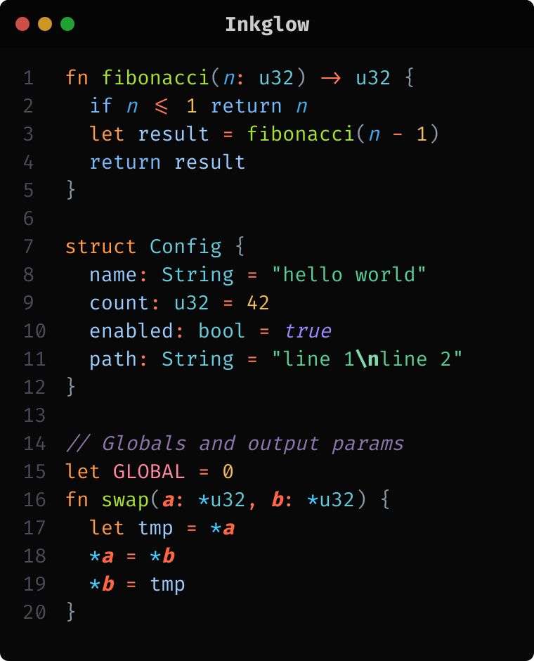
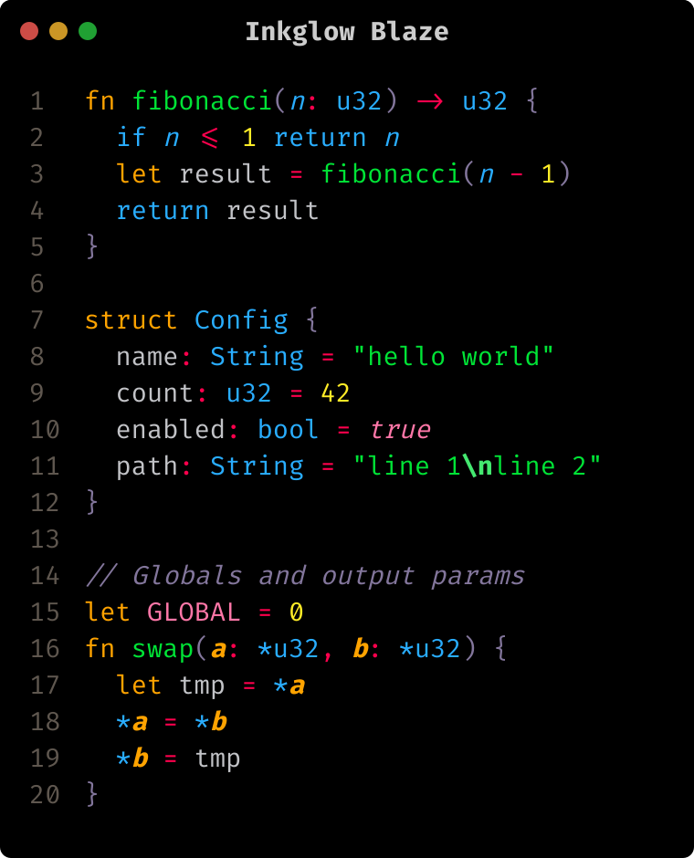
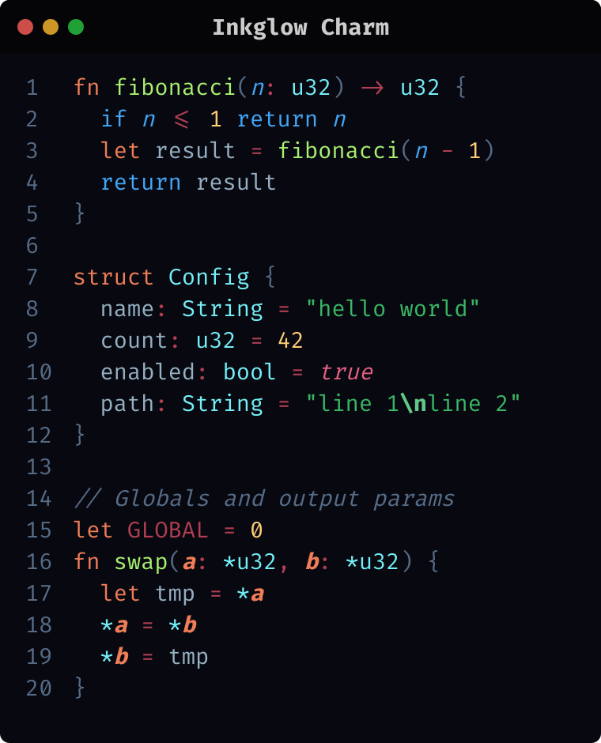
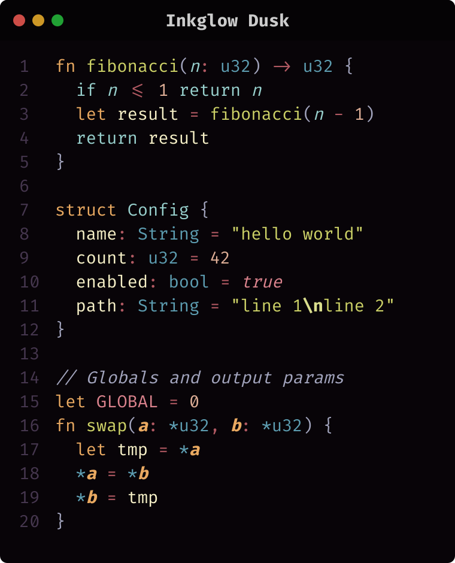
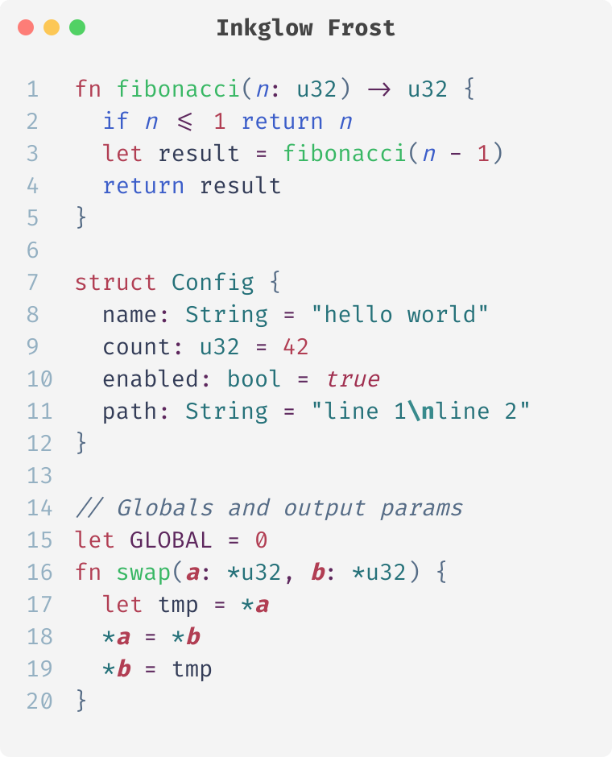
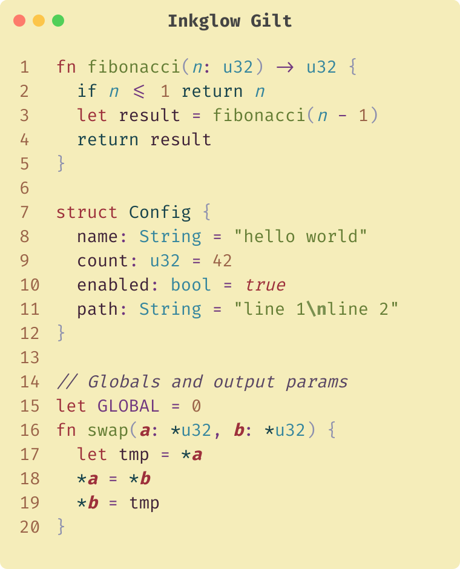
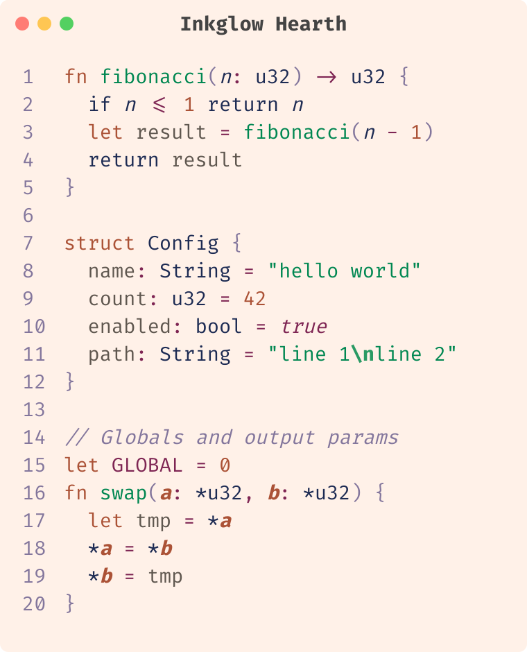
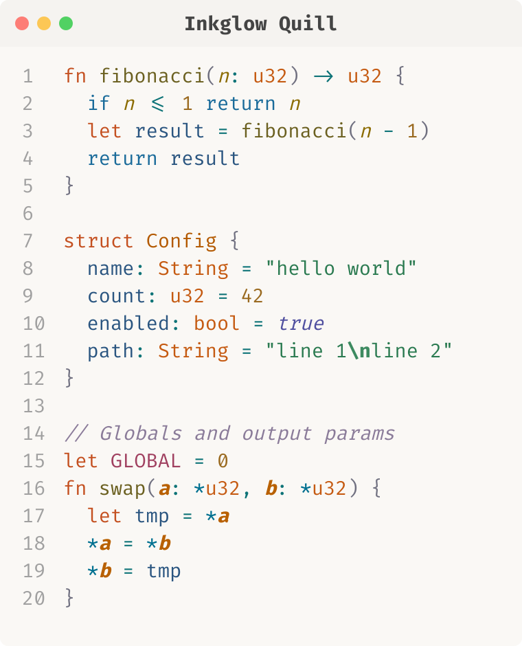
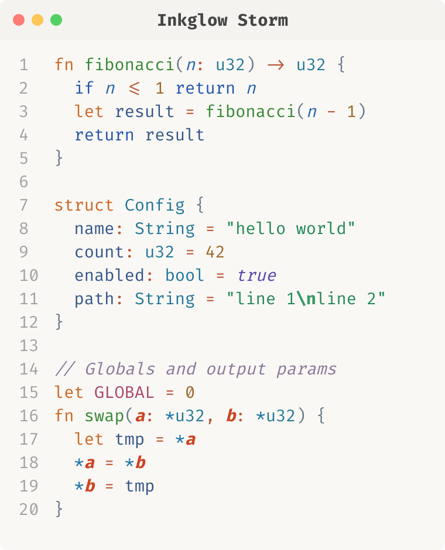

# Inkglow

Color themes for VS Code and terminal tools. 9 themes across dark/light variants with curated retro palettes.

## Themes

| Theme | Type | Palette |
|-------|------|---------|
| Inkglow | dark | Gel-pen neons on black |
| Inkglow Quill | light | Warm earthtone inks |
| Inkglow Storm | light | Blue/orange contrast |
| Inkglow Charm | dark | Sweetie-16 retro palette |
| Inkglow Frost | light | Sweetie-16 retro palette |
| Inkglow Blaze | dark | PICO-8 game palette |
| Inkglow Hearth | light | PICO-8 game palette |
| Inkglow Dusk | dark | NA16 retro palette |
| Inkglow Gilt | light | NA16 retro palette |

## Preview

### Dark

    

### Light

     

## Declarative theme format

Each theme file at the root is a compact JSON mapping of token roles to `"#color style"` values:

```json
{
  "tokens": {
    "comment":          "#8877aa italic",
    "keyword":          "#ff9944",
    "keyword.control":  "#77bbff",
    "string":           "#55cc99",
    "function":         "#a6e22e",
    "variable":         "#99ccff"
  }
}
```

The role names map to TextMate scopes via `scopes.json`. This makes themes easy to compare side-by-side.
