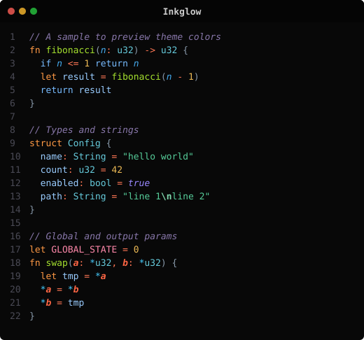
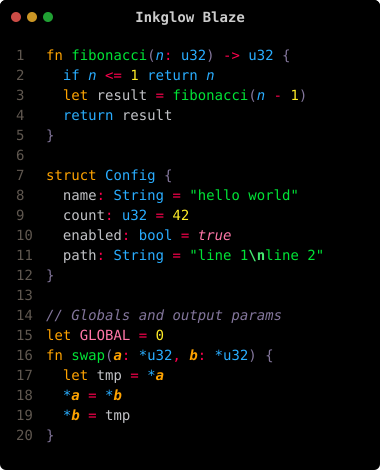
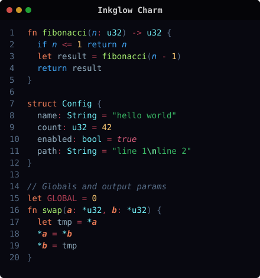
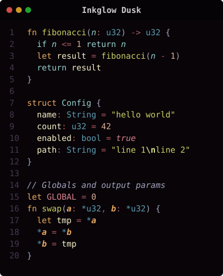
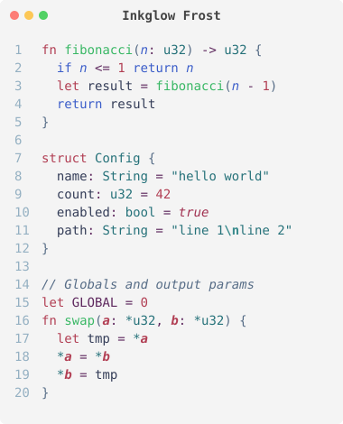
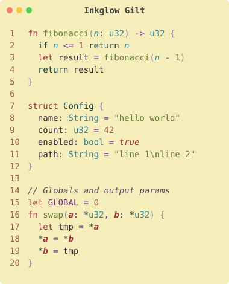
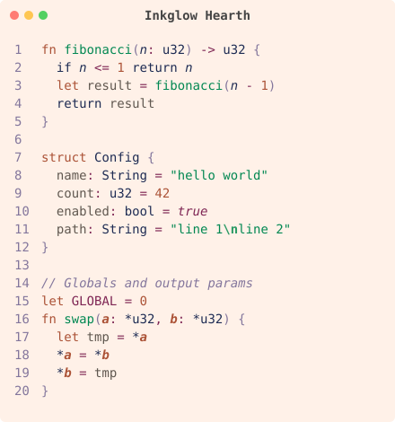
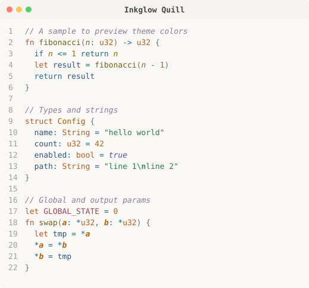
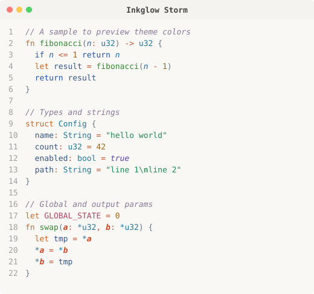
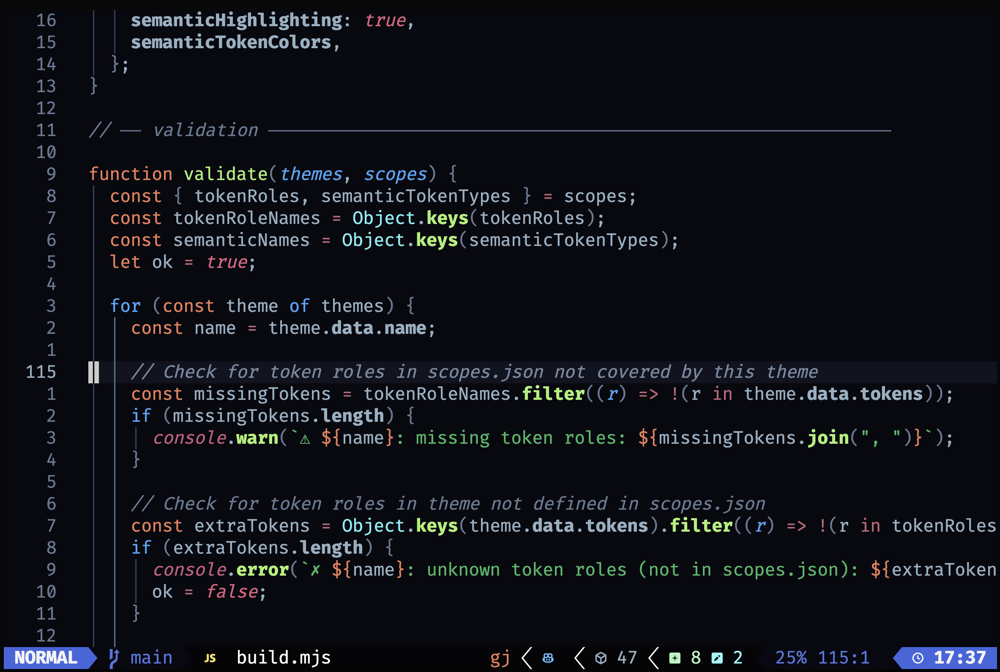

# Inkglow

Color themes for VS Code, Neovim, and terminal tools. 9 themes across dark/light variants with curated retro palettes.

All themes are defined once as compact, human-readable JSON files and built into VS Code themes, Neovim colorschemes, and an importable JS API from the same source.

## Themes

| Theme | Type | Palette |
|-------|------|---------|
| Inkglow | dark | Gel-pen neons on black |
| Inkglow Quill | light | Warm earthtone inks |
| Inkglow Storm | light | Blue/orange contrast |
| Inkglow Charm | dark | Sweetie-16 retro palette |
| Inkglow Frost | light | Sweetie-16 retro palette |
| Inkglow Blaze | dark | PICO-8 game palette |
| Inkglow Hearth | light | PICO-8 game palette |
| Inkglow Dusk | dark | NA16 retro palette |
| Inkglow Gilt | light | NA16 retro palette |

## Preview

### Dark

    

### Light

     

## Install

### VS Code

Install from the VS Code Marketplace, or from source:

```sh
git clone https://github.com/creationix/inkglow.git
cd inkglow
node build.mjs
code --install-extension .
```

### Neovim

Add the repo with your plugin manager, then set the colorscheme:

```lua
-- lazy.nvim
{ "creationix/inkglow" }

-- packer
use "creationix/inkglow"
```

```vim
colorscheme inkglow          " flagship dark
colorscheme inkglow-dusk     " or any variant
```


*Inkglow Charm theme in Neovim with Treesitter highlighting*

### CLI tools (npm)

```sh
npm install @creationix/inkglow
```

Import the theme data directly in Node.js tools, REPLs, or terminal applications:

```js
import { getTheme, colorize, toAnsi256, getAnsi256Map } from "@creationix/inkglow";

// Get a theme by name
const theme = getTheme("Inkglow");

// Colorize text for terminal output using 256-color ANSI codes
process.stdout.write(colorize(theme, "keyword", "fn "));
process.stdout.write(colorize(theme, "function", "fibonacci"));
process.stdout.write(colorize(theme, "bracket", "("));
process.stdout.write(colorize(theme, "parameter", "n"));
process.stdout.write(colorize(theme, "bracket", ")"));

// Get the ANSI 256-color code for any hex color
const code = toAnsi256("#ff9944"); // → 209

// Get a full lookup table for building your own renderer
const map = getAnsi256Map(theme);
// map.keyword  → { code: 209, fontStyle: undefined }
// map.comment  → { code: 103, fontStyle: "italic" }
```

You can also import individual theme JSON files directly:

```js
import inkglow from "@creationix/inkglow/inkglow.json" with { type: "json" };
import scopes from "@creationix/inkglow/scopes.json" with { type: "json" };
```

## Project structure

```
├── scopes.json           # Scope registry — all targeted TextMate + semantic scopes
├── inkglow.json          # Declarative theme source files (compact, human-readable)
├── inkglow-quill.json
├── ...
├── build.mjs             # Generates themes/ (VS Code) and colors/ (Neovim)
├── preview.mjs           # TUI previewer using 256-color ANSI
├── screenshots.mjs       # SVG screenshot generator
├── index.mjs             # npm entry point for CLI tools
├── themes/               # Generated VS Code themes (gitignored)
├── colors/               # Generated Neovim colorschemes (gitignored)
└── screenshots/          # Generated SVG previews
```

## Declarative theme format

Each theme file at the root is a compact JSON mapping of token roles to `"#color style"` values:

```json
{
  "tokens": {
    "comment":          "#8877aa italic",
    "keyword":          "#ff9944",
    "keyword.control":  "#77bbff",
    "string":           "#55cc99",
    "function":         "#a6e22e",
    "variable":         "#99ccff"
  }
}
```

The role names map to TextMate scopes (via `scopes.json`), Vim syntax groups, and Treesitter captures. This makes themes easy to compare side-by-side and keeps the single source of truth for all output formats.

## Development

Open this repo in VS Code, then:

- **F5** — launches an Extension Development Host with the themes loaded (runs `build` automatically)
- **Cmd+Shift+B** — run the default build task

### CLI

```sh
node build.mjs              # Generate VS Code themes + Neovim colorschemes
node build.mjs --check      # Validate scope coverage without writing
node build.mjs --report-256 # Show 256-color fidelity for each theme

node preview.mjs            # Preview all themes in terminal (256-color)
node preview.mjs inkglow.json  # Preview a specific theme
node preview.mjs --compact  # Side-by-side view (auto-fits terminal width)
node preview.mjs --dark     # Only dark themes
node preview.mjs --light    # Only light themes
node preview.mjs --palette  # Show color palette with 256-color mappings

node screenshots.mjs --readme  # Regenerate SVG previews + update README
```

## Scope registry

`scopes.json` lists every TextMate scope and semantic token type that themes target. Use it to:
- Cross-reference when building language grammars
- Validate that themes cover all scopes consistently
- Understand which roles are available for coloring
